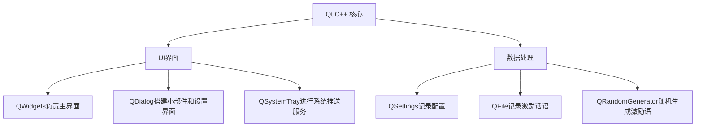

# BattleForFuture
这是一个适用于高考生的倒计时小工具


> "乾坤未定，你我皆黑马！" - 让BattleForFuture成为你的高考战友

## 功能亮点

### 🚀 高考倒计时
- 动态显示距离高考和一模的天数


- 化身桌面小部件，让你时刻看见高考倒计时，激发你的斗志
  


### 💪 智能激励
- 每日随机励志名言（如"今日不肯埋头，明日何以抬头"）
- 支持通过系统推送服务进行启动推送
  


### 🎉 定制化
- 可以设置你的高考年份
  > 默认是6月13日前的判定是今年，否则默认明年
- 同时支持简体和繁体中文
  


- 支持更改小组件的背景颜色
- 支持更改小组件显示的内容


- 可以自定义鼓励语句


## 技术架构



## 安装指南

## Windows
- 方法一：
```
1. 下载压缩包 `BattleForFuture-Windows.zip`
2. 解压到指定位置
2. 启动程序 `BattleForFuture.exe`
```
- 方法二：
```
1. 下载安装包 `BattleForFuture.exe`
2. 根据安装文件提示进行操作
2. 启动程序 `BattleForFuture.exe`
```
## Linux
- 方法一：
```
1.下载安装包 `BattleForFuture-AMD64.deb"
2.运行命令 `sudo dpkg -i ./BattleForFuture-AMD64.deb -B /usr/bin`
3.在"/usr/bin"目录下启动AppRun
```
- 方法二：
```
1. 下载压缩包 `BattleForFuture-Linux.tar.gz`
2. 解压到指定位置
2. 启动AppRun
```
### 开发环境
## Windows环境
- Qt 6.8.3
- qmake
- MSVC 2022,x86_64

## Linux环境
- Qt 6.8.3
- qmake
- Debian 12
- GCC 13.3.0

### 项目结构
```
BattleForFuture/
├── src/                # 源代码
│   ├── core/           # 核心逻辑
│   ├── ui/             # 用户界面
│   ├── data/           # 数据处理
│   └── utils/          # 工具类
├── resources/          # 资源文件
│   ├── quotes/         # 励志名言库
│   └── icons/          # 图标资源
└── BattleForFuture.pro # 构建配置
```

## 贡献指南

我们欢迎任何形式的贡献！请遵循以下步骤：

- 1. Fork 项目仓库  
- 2. 创建你的特性分支 (`git checkout -b BattleForFuture/AmazingFeature`)
- 3. 提交更改 (`git commit -m 'Add some AmazingFeature'`)
- 4. 推送到分支 (`git push origin BattleForFuture/AmazingFeature`)
- 5. 提交 Pull Request

## 联系我们

如有任何问题或建议，请提交issues：
- GitHub Issues: [问题提交](https://github.com/BuBaiMengJ4/BattleForFuture/issues)

---

**为梦想而战，你我皆是黑马！** ✨  
愿每位考生都能在高考中取得理想成绩，金榜题名！
