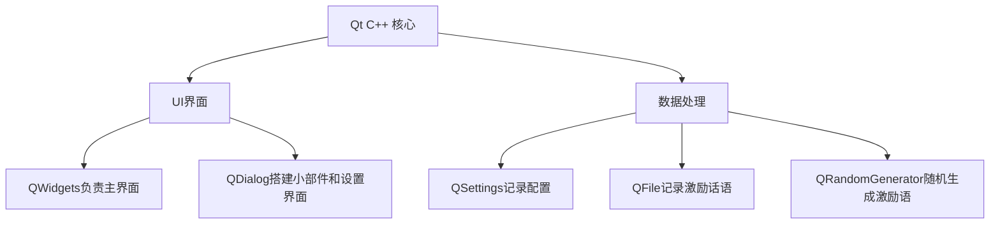

# BattleForFuture
这是一个适用于高考生的倒计时小工具


> "乾坤未定，你我皆黑马！" - 让BattleForFuture成为你的高考战友

## 功能亮点

### 🚀 高考倒计时
- 动态显示距离高考和一模的天数

### 💪 智能激励
- 每日随机励志名言（如"今日不肯埋头，明日何以抬头"）

### 桌面小部件
- 化身桌面小部件，让你时刻看见高考倒计时，激发你的斗志

## 技术架构



## 安装指南

### Windows
##方法一：
```
1. 下载压缩包 `BattleForFuture.zip`
2. 解压到指定位置
2. 启动程序 `BattleForFuture.exe`
```
##方法二：
```
1. 下载压缩包 `BattleForFuture.exe`
2. 根据安装文件提示进行操作
2. 启动程序 `BattleForFuture.exe`
```

## 使用教程
```
1.主页上的"缩小为桌面小部件"，可以化身为左面右上角的小部件，显示高考倒计时时刻提醒你。

2.打开设置，可以在其中设定开机自启动。
3.你可以设定程序启动时默认为小部件。
4.你可以在设置中快捷而方便的更改适合你的鼓励语句。
```

### 开发环境

- Qt 6.8.3
- qmake
- MSVC 2022,x86_64


### 项目结构
```
BattleForFuture/
├── src/                # 源代码
│   ├── core/           # 核心逻辑
│   ├── ui/             # 用户界面
│   ├── data/           # 数据处理
│   └── utils/          # 工具类
├── resources/          # 资源文件
│   ├── quotes/         # 励志名言库
│   └── icons/          # 图标资源
└── BattleForFuture.pro # 构建配置
```

## 贡献指南

我们欢迎任何形式的贡献！请遵循以下步骤：

- 1. Fork 项目仓库  
- 2. 创建你的特性分支 (`git checkout -b BattleForFuture/AmazingFeature`)
- 3. 提交更改 (`git commit -m 'Add some AmazingFeature'`)
- 4. 推送到分支 (`git push origin BattleForFuture/AmazingFeature`)
- 5. 提交 Pull Request

## 联系我们

如有任何问题或建议，请提交issues：
- GitHub Issues: [问题提交](https://github.com/BuBaiMengJ4/BattleForFuture/issues)

---

**为梦想而战，你我皆是黑马！** ✨  
愿每位考生都能在高考中取得理想成绩，金榜题名！
