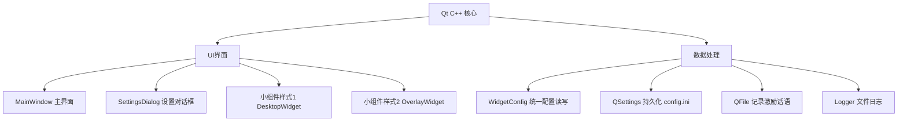

# BattleForFuture
这是一个适用于2026届高考生的倒计时小工具


> "乾坤未定，你我皆黑马！" - 让BattleForFuture成为你的高考战友

## 功能亮点

### 🚀 高考倒计时
- 动态显示距离高考和一模的天数
- 跨零点自动刷新，长期挂机也不会显示过期数字

### 💪 智能激励
- 每日随机励志名言（如"今日不肯埋头，明日何以抬头"）

### 🧩 两种桌面小组件样式（设置中随时切换）
| 样式 | 说明 |
| --- | --- |
| **样式 1 · 圆角卡片** | 圆角卡片，带「退出 / 返回主界面」按钮，支持自定义**背景色** |
| **样式 2 · 右下角透明区域** | 屏幕右下角的无边框、无标题栏、**完全透明**区域，只显示「距离一模/高考还有 N 天」，数字为 LCD 七段数码管 |

- 两种样式都支持鼠标拖动移动、双击返回主界面；
- 两种样式都可以自由定义**文字颜色**与 **LCD 数字颜色**，并可调整文字大小；
- 选择样式 2 时，「背景色」设置会自动禁用并给出原因提示（切回样式 1 自动恢复，原取值不会被清除）。

### 💻 跨平台显示
- Windows / Linux 行为一致：透明区域不会出现黑块（详见下文「Linux 透明实现」）。

## 技术架构


```mermaid
graph TD
    A[Qt C++ 核心] --> B[UI界面]
    A --> C[数据处理]

    B --> E[MainWindow 主界面]
    B --> F[SettingsDialog 设置对话框]
    B --> G["小组件样式1 DesktopWidget"]
    B --> H["小组件样式2 OverlayWidget"]
    C --> I[WidgetConfig 统一配置读写]
    C --> J[QSettings 持久化 config.ini]
    C --> K[QFile 记录激励话语]
    C --> L[Logger 文件日志]
```

## 安装指南

### Windows
1. 下载压缩包 `BattleForFuture.zip`
2. 解压到指定位置
3. 启动程序 `BattleForFuture.exe`

### Linux
1. 解压 `BattleForFuture.tar.gz`
2. 确保已安装 Qt 6 运行库与 xcb 平台插件
3. 运行 `./BattleForFuture`

> 若你的 X11 会话确实有合成器但被判定为不支持，可设置环境变量 `BFF_ASSUME_COMPOSITED=1` 强制启用透明。

## 使用教程
```
1. 主页上的"小部件模式"按钮，可以让程序化身为桌面小组件。
2. 打开设置 → 小组件设置，可以在"样式 1（圆角卡片）"与
   "样式 2（右下角透明区域）"之间自由切换，并自定义文字颜色、
   LCD 数字颜色、文字大小与倒计时目标。
3. 打开设置 → 常规设置，可以设定开机自启动、启动后直接进入的界面、
   显示语言与参加高考年份。
4. 打开设置 → 文字编辑，可以快捷地修改适合你的鼓励语句。
5. 小组件上用鼠标拖动可移动位置，双击可返回主界面。
```

### 开发环境

- Qt 6.11.1（Qt 6.2+ 均可）
- qmake
- MinGW 13.1 / MSVC 2022（x86_64）

### 项目结构
```
BattleForFuture/
├── main.cpp                 # 入口：表面格式、会话校验、单实例、启动形态
├── mainwindow.{h,cpp}       # 主界面 + 小组件宿主
├── settingsdialog.{h,cpp}   # 设置对话框（分类导航、页面惰性构建）
├── desktopwidget.{h,cpp}    # 小组件样式 1：圆角卡片（记忆窗口位置）
├── overlaywidget.{h,cpp}    # 小组件样式 2：右下角透明区域（固定停靠、禁止拖动）
├── sevensegmentdisplay.{h,cpp} # 自绘 LCD 七段数码管（主页倒计时数字）
├── widgetstyle.{h,cpp}      # 小组件配置的统一读写（WidgetConfig，含位置记忆）
├── textutils.{h,cpp}        # 简体 -> 繁体运行时转换（繁体界面支持）
├── platformsupport.{h,cpp}  # 平台能力探测（Linux 合成器判定）
├── appinstance.{h,cpp}      # 单实例协调（第二次启动唤醒已有窗口）
├── logger.{h,cpp}           # 文件日志
├── diagnostics.{h,cpp}      # 崩溃捕获 / 卡死监视 / 阶段埋点
├── mainwindow.ui            # 主界面布局
├── resource.qrc             # 图标与翻译资源
├── Assets/quotes.txt        # 励志名言库
└── BattleForFuture.pro      # 构建配置
```

## 排查问题时的日志位置

```
<程序目录>/Logs/BattleForFuture_yyyy-MM-dd.log    # 运行日志（含操作阶段埋点）
<程序目录>/Logs/BattleForFuture_crash.log         # 崩溃时的异常详情（仅崩溃时生成）
<程序目录>/Logs/dumps/crash_yyyyMMdd_HHmmss.dmp   # 崩溃转储，可用调试器打开看调用栈
```

同一日志文件里若出现 `检测到界面线程疑似卡死：已阻塞 N ms，最后阶段: xxx`，
说明界面线程在 `xxx` 这一步被阻塞，可直接据此定位。

## 贡献指南

我们欢迎任何形式的贡献！请遵循以下步骤：

- 1. Fork 项目仓库  
- 2. 创建你的特性分支 (`git checkout -b BattleForFuture/AmazingFeature`)
- 3. 提交更改 (`git commit -m 'Add some AmazingFeature'`)
- 4. 推送到分支 (`git push origin BattleForFuture/AmazingFeature`)
- 5. 提交 Pull Request

## 联系我们

如有任何问题或建议，请提交issues：
- GitHub Issues: [问题提交](https://github.com/BuBaiMengJ4/BattleForFuture/issues)

---

**为梦想而战，你我皆是黑马！** ✨  
愿每位考生都能在高考中取得理想成绩，金榜题名！
